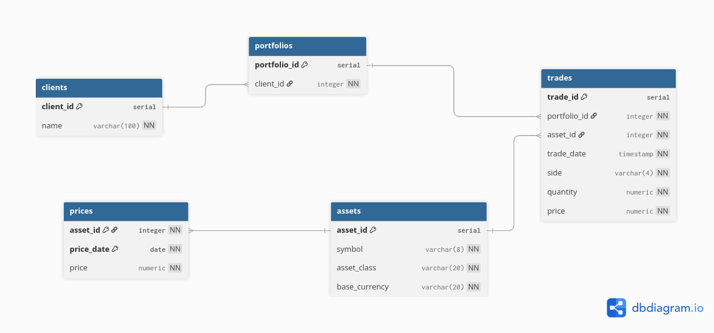

# Client-Portfolio-Risk-Management-DB

## Use case
An investment company wants a system to manage client portfolios and assess portfolio risk. 
They need to store data about clients, their portfolios, individual assets, transactions, and risk profiles, and run queries to support decision-making.

## Entities
- Clients
- Portfolios
- Assets
- Trades
- Prices

## Cardinalities
- Client 1 - N Portfolios 
- Portfolio 1 - N Trades
- Asset (Instrument) 1 - N Trades
- Asset 1 - N Prices
- Price N - 1 Asset (and at most one price per asset per date)

## ER Diagram

