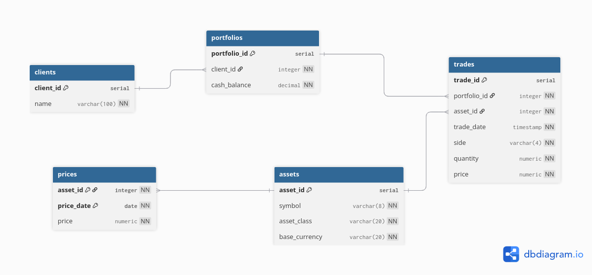

# Client-Portfolio-Management-DB
PostgreSQL and python based system for to store and manage data about clients, portfolios, assets, and trades.

## Table of Contents
- [Features](#features)
- [Demo video](#demo-video)
- [Database Design](#database-design)
  - [Entities](#entities)
  - [Cardinalities](#cardinalities)
  - [ER Diagram](#er-diagram)
- [Setup](#setup)
  - [Prerequisites](#prerequisites)
  - [Setup Instructions](#setup-instructions)
- [Usage](#usage)
  - [Basic Commands](#basic-commands)
  - [Management Commands](#management-commands)

## Features
- **Client Data Management**: Store and manage client information
- **Portfolio Tracking**: Track multiple portfolios per client with cash balances
- **Asset Management**: Support for stocks, bonds, forex, and crypto across multiple currencies
- **Trade Recording**: Complete trade history with buy/sell transactions
- **Price Tracking**: Historical price data for assets
- **Data Migration**: Migration workflow for database schema changes
- **CLI Interface**: Command-line interface for all operations

## Demo Video


[](https://www.youtube.com/watch?v=dQw4w9WgXcQ)

Click the image above to watch a demonstration of the client portfolio management system


## Database Design

### Entities
- Clients
- Portfolios
- Assets
- Trades
- Prices

### Cardinalities
- Client 1 - N Portfolios 
- Portfolio 1 - N Trades
- Asset (Instrument) 1 - N Trades
- Asset 1 - N Prices
- Price N - 1 Asset (and at most one price per asset per date)

### ER Diagram



## Setup

### Prerequisites

- Git
- Python 3.7+
- Docker OR PostgreSQL database server

### Setup Instructions

1. **Clone the repository**
   ```bash
   git clone https://github.com/jbrowne7/client-portfolio-risk-management-DB.git
   cd client-portfolio-risk-management-DB
   ```

2. **Create and activate a virtual environment**
   
   **macOS/Linux:**
   ```bash
   python3 -m venv venv
   source venv/bin/activate 
   ```
   
   **Windows:**
   ```cmd
   python -m venv venv
   venv\Scripts\activate
   ```

3. **Install dependencies**
   ```bash
   pip install -r requirements.txt
   ```

4. **Set up environment variables**
   
   **macOS/Linux:**
   ```bash
   cp .env.sample .env
   ```
   
   **Windows:**
   ```cmd
   copy .env.sample .env
   ```

5. **Database setup:**

   **Option A: Using Docker (Recommended)**
   
   a. Start PostgreSQL with Docker Compose:
   ```bash
   docker-compose up -d
   ```
   
   b. The `.env` file is already configured to work with the Docker database.

   **Option B: Using Local PostgreSQL**
   
   a. Install PostgreSQL if not already installed
   
   b. Create a new database for the project
   
   c. Update the `.env` file with your local database configuration:
   ```
   DB_NAME=your_database_name
   DB_USER=your_username
   DB_PASSWORD=your_password
   DB_HOST=localhost
   DB_PORT=5432
   ```

6. **Initialize the database**
   ```bash
   cd src
   python main.py init
   ```
   
   Note: On some systems, you may need to use `python3` instead of `python`*

7. **Generate data**
   ```bash
   python generate_data.py
   ```

## Usage

### Basic Commands
```bash
# View all available commands
python main.py --help

# Get all clients
python main.py get_all_clients

# Get portfolio values
python main.py port_vals

# Get top performing portfolios
python main.py get_top_portfolios --n 10

# Add a new client
python main.py add_client --name "John Doe"

# Search for a client
python main.py search_client --name "John"
```

### Management Commands
```bash
# Create database migration
python main.py make_migration --name "add_new_feature"

# Run a migration
python main.py run_migration --name "migrations/001_migration_file.sql"

# Clear all data
python main.py wipe_db
```
